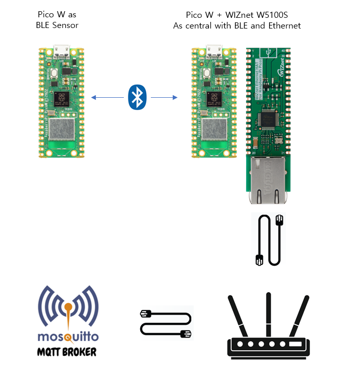
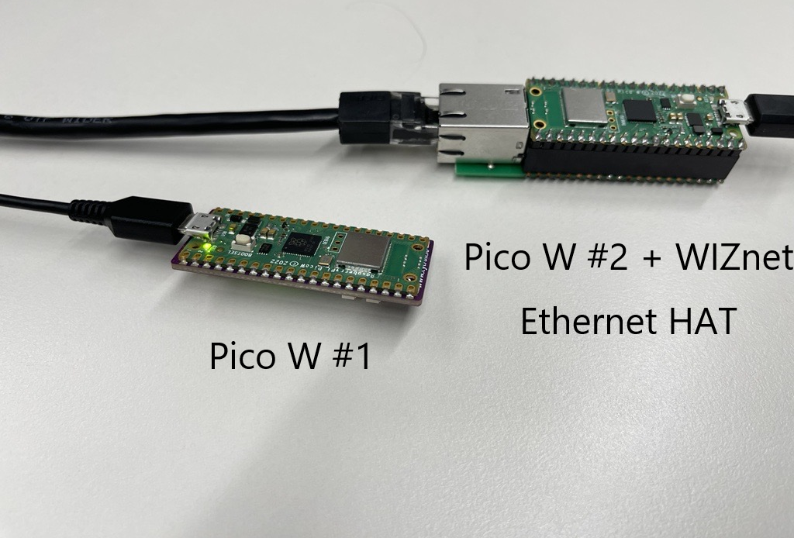
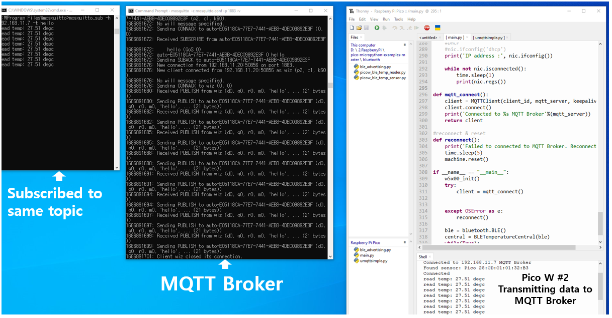

# HAT-PicoW-BLE-to-Ethernet-Central

## Introduction

Few days ago Raspberry Pi released new SDK that added missing feature to Pico W - Bluetooth support. For more information please refer to this [RPi blog post](https://www.raspberrypi.com/news/new-functionality-bluetooth-for-pico-w/).

In the [Connecting to the Internet with Raspberry Pi Pico W](https://datasheets.raspberrypi.com/picow/connecting-to-the-internet-with-pico-w.pdf) there are great examples to get started. At the time of writing this post there were examples only for C and Micropython.

I have never tried coding in Micropython, so this time I decided to challenge myself and learn something new.

## Idea

In the book there are examples how to turn Pico W into BLE sensor and central. I decided to add Ethernet connectivity to BLE central and transmit data from BLE sensor to MQTT broker on my PC.

## How it went...

Sounds easy and simple right? But as usual, devil is in the details. As it is my first time working with Micropython I had no idea where to start.

First, I started my study from [WIZnet SDK for HAT and Micropython](https://github.com/Wiznet/RP2040-HAT-MicroPython/tree/main). This gave me the information where to start and what to do.

As bluetooth was added in latest commits, I needed to build a firmware for Pico W that would contain WIZNET5K library.

I will skip the phase with WSL installation and configuration of Micropython on local machine.

Long story short:

Pico W #1 will be running the given BLE_temp_sensor.py from the book. No changes were made in the code.

Pico W #2 will be combined with WIZnet Ethernet HAT. The firmware was customized to contain WIZNET5K library. The example Central code from the book was combined with MQTT publish example from WIZNet Micropython SDK. Firmware file and source code are attached below.

Mosquitto broker will be running on my local machine.

Results are shown in below image and video.

[Youtube Video Link](https://youtu.be/q_VTbWTh0u0)

